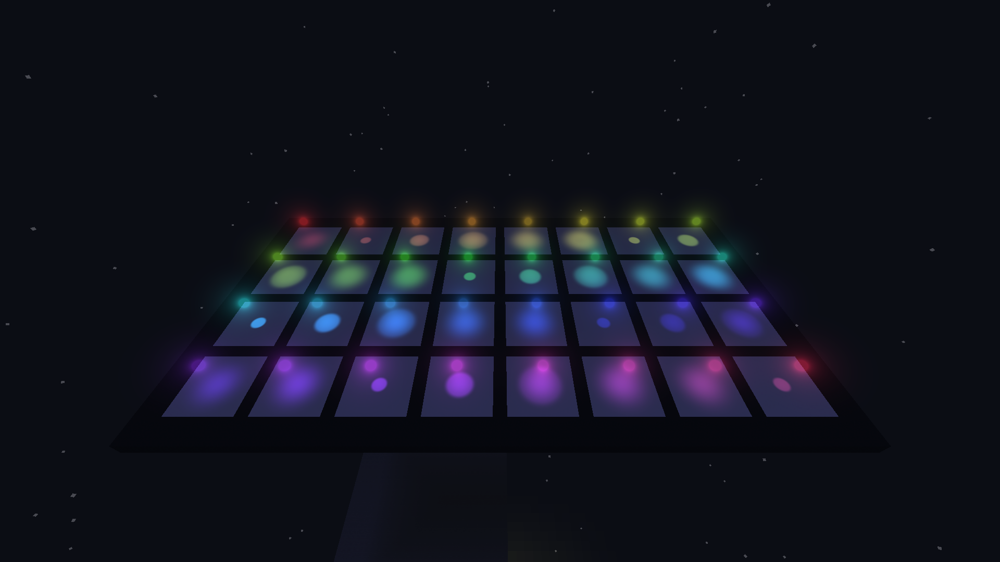

# Chroma — automatic coloured lights

A standalone, shadow-free resource pack for **Minecraft Java 26.3** (resource-pack format **97.1**). Up to **128 simultaneously rendered light sources** are collected automatically. Reuse the same five light models with independent colours, radii, brightness and directions: no manually assigned slots, no second entity per light, no required mod or datapack.

- [English guide](docs/README.en.md)
- [Инструкция на русском](docs/README.ru.md)
- [Commands / Команды](docs/examples.mcfunction)
- [128-light example / Пример с 128 источниками](docs/examples-128.mcfunction)
- [Validation / Проверки](docs/VALIDATION.md)
- [Credits](CREDITS.md)

Place the pack in `minecraft/resourcepacks`, enable it and press **F3+T** after replacing files. Lights are created with vanilla `item_display` summon commands. The resource pack does not create entities itself. The 128-source rendering budget is finite; this release does not promise an unlimited number of simultaneous lights. In the `objCubed` world, the 128-light test datapack is installed: run `/reload`, then `/function chroma_test:spawn128`; remove its lights with `/function chroma_test:clear128`.

