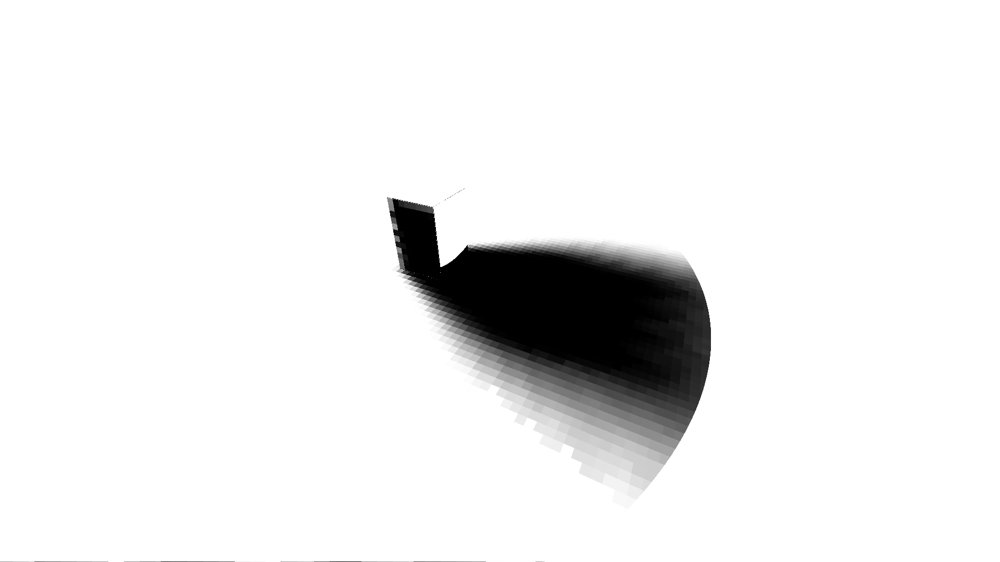
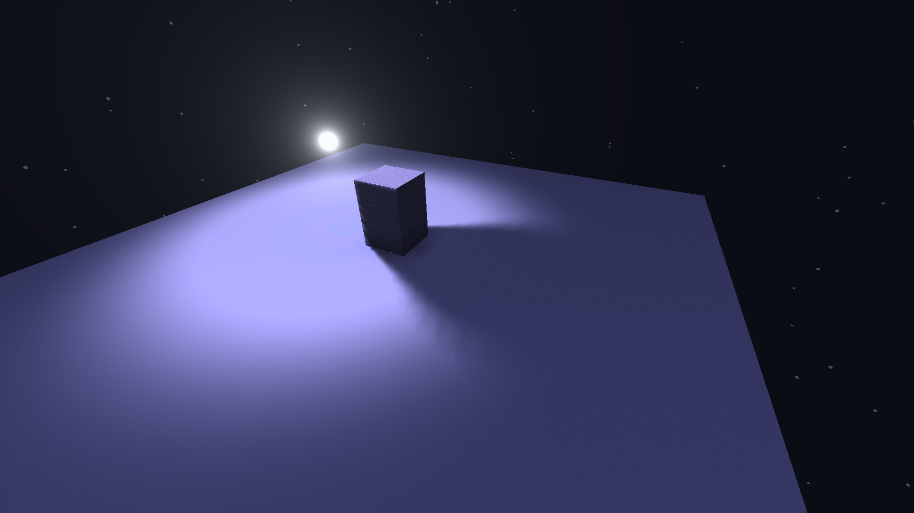
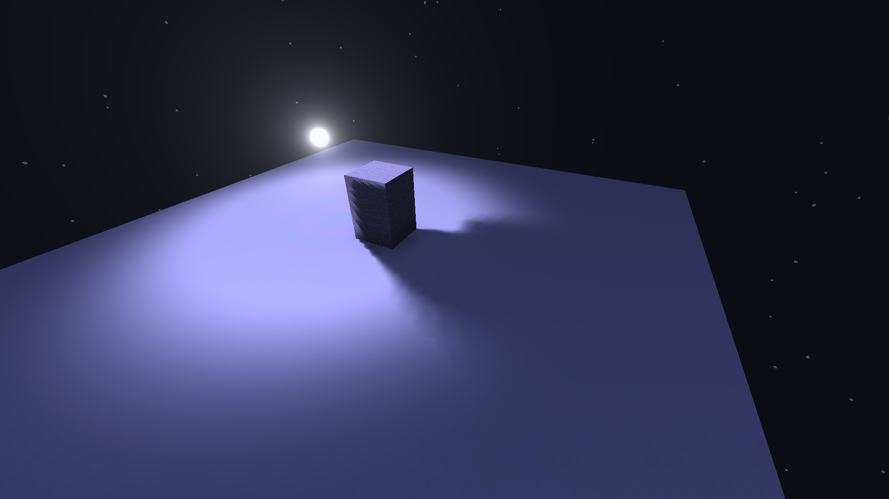

# Shadow validation / Проверка теней

2026-09-30 (Europe/Moscow). Shadow branch: `codex/source-shadows`. The shadow-free Auto128 baseline remains on `main` at `cda64ae`; see [Auto validation](VALIDATION.md). / Ветка теней: `codex/source-shadows`. Основной Auto128 без теней сохранён в `main`, коммит `cda64ae`; см. [проверки Auto](VALIDATION.md).

## Current revision: Axiom near-source loss / Текущая правка: пропадание возле источника в Axiom

The open-space failure was reproduced in a separate copy of `objCubed` with all seven installed mods, including Axiom **6.1.2**, Sodium **0.9.3-alpha.1** and Fabric Loader **0.19.5**, using the user's Axiom settings (`showDisplayEntities=true`, range 8). The original world and running client were not controlled. At the same camera position, hiding/showing/hiding the HUD changed emitter-cell occupancy **0 → 3 → 0** and the fraction of zero-distance shadow rays **0 → 1 → 0**. The camera packet and source count stayed valid throughout. Axiom's central editor cube was being recorded as an obstacle at the emitter. / Сбой в открытом месте воспроизведён в отдельной копии `objCubed` со всеми семью установленными модами, включая Axiom **6.1.2**, Sodium **0.9.3-alpha.1**, Fabric Loader **0.19.5**, и настройками пользователя (`showDisplayEntities=true`, радиус 8). Исходный мир и работающий клиент не управлялись. В одном ракурсе скрытие/показ/скрытие HUD меняло заполненность ячейки источника **0 → 3 → 0**, а долю нулевых лучей теней **0 → 1 → 0**. Пакет камеры и число ламп оставались правильными: препятствием становился центральный редакторский куб Axiom.

The final Dynamic candidate passed **12/12** live checks: three HUD states, four views with the handle overlapping the camera packet, and five captures during **33** real light-movement commands. Every capture retained one source, an empty emitter cell and no zero-distance shadow rays. The moving test exercised Axiom's automatically interpolated handle; it did not simulate mouse dragging an actively selected handle. This was tested with visible HUD, no input-lock screen during the relevant captures, and Axiom active with entity-manipulation protocol support. / Финальный Dynamic прошёл **12/12** живых проверок: три состояния HUD, четыре ракурса с наложением маркера на пакет камеры и пять снимков во время **33** настоящих команд перемещения света. На каждом снимке источник сохранялся, его ячейка оставалась пустой, нулевые лучи отсутствовали. Проверялось автоматическое сглаживание маркера движущейся лампы; перетаскивание выбранной лампы мышью не имитировалось. Во время нужных снимков HUD был виден, экран блокировки ввода снят, Axiom активен и протокол управления сущностями доступен.

A separate Sodium failure was also reproduced at **0.08 blocks from a wall**: the previous terrain guard was ignored and the camera packet disappeared. Headers now use depth 1 and identical full-scan bounds; no terrain shader replacement is needed. The editor cube receives interface depth and leaves transport pixels intact. Actual blocks at the source remain shadow casters. / Отдельно воспроизведён сбой Sodium на расстоянии **0.08 блока от стены**: прежняя защита в terrain игнорировалась и пакет камеры исчезал. Теперь заголовки имеют глубину 1 и одинаковую границу полного сканирования; замена terrain больше не нужна. Редакторский куб получает интерфейсную глубину и пропускает служебные пиксели. Настоящие блоки в позиции лампы по-прежнему создают тени.

Native validation passed **22/22** shader files in each mode, **170 stages / 85 driver links** for Dynamic and **158 / 79** for Static, plus **152** documented commands, with zero failures. CPU checks verify generated shader parity, unchanged native interfaces and packet bounds at four resolutions. These checks are separate from gameplay and FPS tests. / Проверка штатным компилятором прошла для **22/22** файлов шейдеров каждого варианта: **170 стадий / 85 связок драйвера** для Dynamic, **158 / 79** для Static и **152** команды без ошибок. CPU-проверки подтверждают соответствие генератору, сохранение штатных интерфейсов и границы пакетов при четырёх разрешениях. Это отдельные проверки, не замена игровым тестам и FPS.

The final vanilla and all-mods close-camera checks each passed **5/5** poses (wall distances 0.12/0.08, camera/source separation 0.01/0, and 0.01 above the source). Static also retained the correct source and a nonzero shadow-distance map with Axiom/HUD visible in the copied world. The 128-source fixture passed all 128 distinct colours, five shapes, all four tile-mask banks, fresh records and finite shadow maps. / Финальные проверки без модов и со всеми модами прошли по **5/5** близких ракурсов (0.12/0.08 от стены, 0.01/0 от источника и 0.01 над ним). Static также сохранил правильный источник и ненулевую карту расстояний при видимых Axiom/HUD в копии мира. Тест 128 ламп подтвердил 128 разных цветов, пять форм, все четыре группы масок, свежие записи и корректные карты теней.

Paired Dynamic timings at **1920×1080**, same camera and correctly working lights, with HUD hidden in both runs to exclude the old Axiom failure from the comparison: / Парные замеры Dynamic при **1920×1080**, одинаковой камере и работающем свете, со скрытым HUD в обеих версиях, чтобы прежний сбой Axiom не искажал сравнение:

| Scene / Сцена | Previous avg / До, средний FPS | Revised avg / После, средний FPS | Previous / revised low 1% FPS / До / после |
| --- | ---: | ---: | ---: |
| 1 light, copied world / 1 лампа, копия мира | 505.79 | 507.18 | 234.88 / 242.67 |
| 128 lights and blockers / 128 ламп и препятствий | 397.63 | 398.65 | 191.49 / 180.86 |

Each run used five seconds of warmup; timing lasted five seconds for one light and ten seconds for 128. The 128-source P99 frame time was **4.791 → 4.827 ms**; **2/3976 → 3/3987** frames exceeded the 144-FPS frame budget. The user's other Minecraft process (PID 58600) remained open. These short same-scene samples show no average-FPS loss in this test, but do not guarantee 144 FPS in other worlds or establish the cause of low-1% variation. / Перед каждым замером было пять секунд прогрева; измерение длилось пять секунд для одной лампы и десять для 128. P99 времени кадра при 128 источниках — **4.791 → 4.827 мс**, за бюджет 144 FPS вышли **2/3976 → 3/3987** кадров. Другой клиент пользователя (PID 58600) оставался открытым. Эти короткие замеры одинаковой сцены не показали потери среднего FPS, но не гарантируют 144 FPS в других мирах и не определяют причину колебаний low 1%.

Reports / Отчёты: `audit/shadows/guard-focused-{sodium,vanilla}-live.json`, `near-plane-single-sodium-live.json`, `near-plane128-sodium-live.json`.

Evidence / Материалы: `audit/shadows/axiom-hud-causality-live.json`, `user-source-sodium-allmods-pair.json`, `axiom-guard-edges-live.json`, `axiom-guard-static-smoke-live.json`, `native-axiom-guard-{dynamic,static}/`, `axiom-release-{assets,transport}.json`. All client control and readback used direct test APIs, without ComputerUse. / Управление тестовым клиентом и чтение данных выполнялись напрямую, без ComputerUse.

## Previous revision: source loss and pixelation / Предыдущая правка: пропадание света и пикселизация

The close-wall source loss was reproduced in the original Dynamic ZIP: at camera distances `0.09`, `0.08`, and `0.06` blocks the camera header and light count both became zero. The same poses passed after adding only the terrain header guard: **14/14** checks with radii 14 and 35.437496 retained the source. This isolates the fix from the voxel and filtering changes. / Пропадание света воспроизведено в исходном Dynamic: на расстояниях камеры `0.09`, `0.08` и `0.06` блока заголовок камеры и число источников обнулялись. После добавления только защиты заголовка в terrain прошли **14/14** повторных проверок с радиусами 14 и 35.437496. Это подтверждает исправление отдельно от изменений вокселей и фильтрации.

Default pixelation was checked in the real client with the same Static geometry and only the pixelation toggle changed. Within 494/485 partially shadowed world-grid squares in two views, the P90 visibility range inside a square was **0** with pixelation and **0.156/0.153** with smooth sampling. Across 485 common squares, changing the camera gave **P95 difference 0**. These are normalized shadow visibility values, not colour or FPS. The square size is 0.25 blocks. / Пикселизация проверена в игре на одинаковой геометрии Static с изменением только переключателя. В 494/485 частично затенённых квадратах двух ракурсов P90 разброса видимости внутри квадрата составил **0** с пикселизацией и **0.156/0.153** с плавной выборкой. Для 485 общих квадратов смена камеры дала **P95 разницы 0**. Это нормированная видимость света, не цвет и не FPS. Размер квадрата — 0.25 блока.

Evidence / Материалы: `audit/shadows/disappearing-{baseline,terrainfix}-live.json`, `revision-pixelation-live.json`. The grayscale preview below shows the actual pixelated shadow mask. / Изображение ниже показывает пиксельную маску тени из игры.

The final Dynamic comparison used the same scene and five-view warmup for both packs. The table counts occupied quarter-cells inside each object's bounds in two camera views; it measures acquired geometry, not a percentage of exact mesh coverage. / Финальное сравнение Dynamic использует одинаковые сцены и предварительный обход пяти ракурсов. Таблица показывает занятые ячейки в границах объекта для двух ракурсов: это объём восстановленной геометрии, а не процент точного покрытия модели.

| Object / Объект | Original / До | Revised / После |
| --- | --- | --- |
| Bottom slab / Нижняя плита | 124 / 124 | 124 / 124 |
| Oak fence / Дубовый забор | 31 / 30 | 76 / 70 |
| Cow / Корова | 5 / 5 | 57 / 57 |

All 16 final comparison captures retained their source. Moving the cow left zero occupied cells at its old location and acquired 52 at its new location. Removing it and its dropped items left zero cells in both locations and full visibility at all 961 sampled floor points in the tested shadow region. An earlier removal check accidentally included real dropped items; after removing those, two floor-contact cells exposed a separate retention bug. The final plane-based clearing rule fixes those cells while retaining the floor. / Во всех 16 финальных снимках источник оставался активным. При перемещении коровы в прежнем месте осталось ноль занятых ячеек, в новом восстановилось 52. После удаления коровы и выпавших предметов в обоих местах осталось ноль ячеек, а все 961 точки пола в проверяемой области тени полностью освещены. Первоначальная проверка удаления включала реальные выпавшие предметы; после их очистки две ячейки у пола выявили отдельную ошибку сохранения кеша. Финальная проверка плоскости очищает эти ячейки, сохраняя сам пол.

Final geometry evidence / Финальные материалы по геометрии: `revision-geometry-final-live.json`, `revision-loot-diagnosis.json`, `revision-loot-clean.json`. The broader first comparison also covered top slabs, solid walls and cobblestone walls (`revision-geometry-live.json`). Native checks on the revised normal-colour builds passed **21 shaders each**, **164 stages / 82 linked programs** for Dynamic and **152 / 76** for Static. CPU geometry, packed storage, hierarchy, camera precision and pixel-grid checks passed separately. / Первое расширенное сравнение также включало верхние плиты, сплошную стену и булыжную стенку (`revision-geometry-live.json`). Проверки обычных цветных сборок прошли: **по 21 шейдеру**, **164 стадии / 82 связанные программы** для Dynamic и **152 / 76** для Static. Отдельно прошли CPU-проверки геометрии, упаковки, иерархии, точности координат и пиксельной сетки.

The revised builds also passed the general 19-check shadow fixture (`revision-dynamic-final-live.json`, `revision-static-live.json`). The normal-colour Dynamic pack passed the 128-source spread test: 128 distinct colours, five shapes, all four mask banks, all source positions and 128 finite shadow maps with blocker samples. A short paired run at 1920×1080 measured original/revised averages **398.79 / 395.51 FPS**, with slowest-1% averages **270.56 / 261.48 FPS** (5-second warmup, 10-second sample each). The primary game remained open, so these are diagnostic timings under concurrent load, not a general FPS guarantee or a comparison with the isolated measurements below. Report: `revision128-pair-20260929-232224-980100.json`. / Обновлённые сборки также прошли общую сцену из 19 проверок. Обычный цветной Dynamic прошёл проверку 128 разнесённых источников: разные цвета, пять форм, все четыре банка масок, позиции и 128 корректных карт теней с препятствиями. Короткий парный замер при 1920×1080 дал до/после **398.79 / 395.51 FPS**, среднее для худшего 1% кадров — **270.56 / 261.48 FPS** (по 5 секунд прогрева и 10 секунд измерения). Основная игра оставалась открыта, поэтому это диагностические замеры при параллельной нагрузке, не гарантия FPS и не сравнение с изолированными измерениями ниже.

## Initial release: English

**Both shadow modes passed the recorded live functional checks. 144 FPS is not guaranteed: the dense, distinct-position 128-light test reached about 31 FPS with shadows.** Tests used an isolated vanilla Minecraft Java 26.3 instance and direct Java/renderer probes, without ComputerUse. The helper probes are test infrastructure, not a runtime requirement of the RP.

The functional fixture has a white floor, a stone blocker spanning `[-1,1,-1]` to `[1,4,1]` (maximum exclusive), and one white point light at `(-3,5,0)`, radius 14. Visibility was read from a debug shader and compared at common world-floor coordinates against independent geometric expectations. Dynamic and Static each passed **19 recorded checks**: six camera views, growing penumbra, offscreen blocker, moving source, and blocker removal. Full-shadow samples had median visibility 0; lit samples had 10th-percentile visibility 1. Across the conservative fully lit/full-shadow regions, camera-change P95 visibility difference was 0. The penumbra width grew from **0.75 to 2.60 blocks** for Dynamic and **0.85 to 2.85 blocks** for Static between the two tested receiver positions.

Static also worked with its blocker offscreen on a cold cache. Dynamic preserved a previously observed blocker offscreen. Moving the light moved the shadow; removing a visible blocker cleared Dynamic's shadow, while Static correctly retained its exported blocker until a new export. Additional checks confirmed byte-identical Dynamic geometry cache with zero lamps, correct shadow after restoring a lamp, and P95 visibility 0 for a Static light buried inside the blocker. A visible hand holding stone was tested separately; the near-camera voxel check found zero occupied cells from the hand/held item.

Camera stability has two distinct limits. Static's partially shadowed regions had median difference `1/255`, with worst comparison P95 `5/255` across 517–546 world samples per view. Dynamic's fresh cache learned new faces as the camera moved, allowing edge differences up to P95 **0.240**. After first observing all six views, a second tour without clearing the cache gave median `1/255` and worst P95 `4/255` across 530–555 partial-shadow samples per view. These results support source-anchored shadows for known geometry, not unconditional camera independence for Dynamic's geometry acquisition.

Native checks separately passed 20/20 pack shaders for each mode, 136 shader stages / 68 driver-linked programs for Dynamic, and 124 / 62 for Static, with zero failures. These compilation checks alone do not establish gameplay performance.

## Исходная версия: русский

**Оба варианта прошли записанные функциональные проверки в игре. 144 FPS не гарантируются: плотная группа из 128 источников в разных позициях дала около 31 FPS с тенями.** Использовался отдельный vanilla-инстанс Minecraft Java 26.3 и прямые Java/рендер-пробы, без ComputerUse. Эти вспомогательные пробы нужны для проверки, а не для работы RP.

Тестовая сцена — белый пол, каменное препятствие от `[-1,1,-1]` до `[1,4,1]` (верхняя граница исключается), белый точечный источник `(-3,5,0)` с радиусом 14. Отладочный шейдер выводил видимость света; результаты сопоставлялись в одинаковых координатах пола с независимым геометрическим расчётом. Dynamic и Static прошли по **19 записанных проверок**: шесть положений камеры, расширение полутени, препятствие вне экрана, перемещение источника и удаление препятствия. Медианная видимость внутри полной тени — 0, 10-й процентиль на освещённом участке — 1. В заведомо полностью затенённых/освещённых областях P95 изменения при смене камеры — 0. Ширина полутени на двух выбранных сечениях выросла с **0,75 до 2,60 блока** у Dynamic и с **0,85 до 2,85 блока** у Static.

Static учитывал препятствие за камерой даже с пустым кешем. Dynamic сохранял тень от ранее увиденного препятствия за экраном. Перемещение источника перемещало тень; удаление видимого препятствия убирало тень Dynamic, а Static ожидаемо сохранял экспортированную геометрию до нового экспорта. Дополнительно проверены побайтовое сохранение кеша Dynamic при отсутствии ламп, тень после возвращения лампы и P95 видимости 0 у источника Static внутри препятствия. Отдельно проверена видимая рука с камнем: в проверяемой области рядом с камерой найдено 0 вокселей от руки/предмета.

Стабильность краёв следует разделять по состоянию геометрии. У Static медианное изменение в полутени составило `1/255`, максимальный P95 среди сравнений — `5/255` при 517–546 точках мира на вид. Новый кеш Dynamic дополнялся при наблюдении других граней, поэтому P95 изменения края доходил до **0,240**. После предварительного обхода всех шести видов повторный обход без очистки кеша дал медиану `1/255`, максимальный P95 `4/255` при 530–555 точках полутени на вид. Это подтверждает привязку теней к источнику при известной геометрии, но не безусловную независимость сбора геометрии Dynamic от камеры.

Отдельные штатные проверки прошли для 20/20 шейдеров каждого пака: 136 стадий / 68 слинкованных драйвером программ Dynamic и 124 / 62 Static, без ошибок. Успешная компиляция сама по себе не подтверждает FPS в игре.

## Performance / Производительность

**Conditions / Условия:** 1920×1080, NVIDIA RTX 4060 Ti, driver 595.71, OpenGL, FOV 70, render distance 8, simulation distance 5; VSync off, unlimited FPS, unpaused, unfocused but not minimized. Each run: 10 s warm-up + 20 s measurement. Complete end-of-frame wall intervals include submission/presentation; no synchronous GPU readback during measurement. All runs had zero invalid intervals. / VSync отключён, FPS не ограничен; игра без паузы и фокуса, окно не свёрнуто. Каждый прогон: 10 с прогрева и 20 с измерения полных межкадровых интервалов, включая отправку/предъявление кадра; синхронного чтения GPU во время замера нет. Некорректных интервалов — 0.

All scenes used 128 stationary sources with varied colours and five shape types; these are not measurements of 128 simultaneously moving lamps. Spread: distributed radius-3.5 lights with individual blockers, overhead camera. Overlap: all lights at `(-3,5,0)`, radius 14. Cluster: 128 distinct positions within `x=-3±0.6`, `y=5`, `z=±0.28`, radius 14, same camera and blocker as Overlap. / Во всех сценах 128 неподвижных источников с разными цветами и пятью типами форм; одновременное движение 128 ламп не замерялось. Spread — распределённые источники радиуса 3,5 с отдельными препятствиями, камера сверху. Overlap — все источники в `(-3,5,0)`, радиус 14. Cluster — 128 разных позиций в пределах `x=-3±0,6`, `y=5`, `z=±0,28`, радиус 14, камера и препятствие как у Overlap.

| Scene / Сцена | Edition / Вариант | Average FPS | 1% low FPS | Median ms | P99 ms | Frames > 6.944 ms / Кадры |
| --- | --- | ---: | ---: | ---: | ---: | ---: |
| Spread | Auto | 894.24 | 319.57 | 1.0067 | 2.5758 | 4 / 17885 |
| Spread | Dynamic | 375.34 | 170.25 | 2.4072 | 5.0125 | 9 / 7507 |
| Spread | Static | 491.34 | 236.82 | 1.8781 | 3.8323 | 1 / 9826 |
| Overlap | Auto | 114.57 | 78.44 | 8.3472 | 11.6464 | 2285 / 2291 |
| Overlap | Dynamic | 78.81 | 57.38 | 11.9238 | 16.6731 | 1575 / 1576 |
| Overlap | Static | 81.46 | 59.01 | 11.7121 | 16.0477 | 1628 / 1629 |
| Cluster | Auto | 110.01 | 79.15 | 8.8784 | 12.0341 | 2197 / 2200 |
| Cluster | Dynamic | 31.25 | 25.10 | 30.5459 | 38.3907 | 625 / 625 |
| Cluster | Static | 31.58 | 25.82 | 30.5509 | 37.5298 | 632 / 632 |

1% low is the reciprocal of the mean duration of the slowest 1% of frames. These are release colour-rendering runs, not debug-visibility timings. The spread scene exceeds 144 FPS on average and at 1% low; dense overlapping scenes miss the target, including Auto. These simple fixtures do not predict FPS in `objCubed` or every world. / 1% low — обратная величина средней длительности самого медленного 1% кадров. Замерялся обычный цветной рендер, а не отладочная видимость. В распределённой сцене средний FPS и 1% low выше 144; плотное перекрытие не достигает цели, включая Auto. Эти простые тестовые сцены не гарантируют FPS в `objCubed` или другом мире.

## Export and evidence / Экспорт и материалы

The `objCubed` Static export has origin `[-16,-64,-48]`, dimensions `[384,64,320]` quarter-block cells (96×16×80 blocks), and 355200 occupied cells. Entities, glass and water are excluded; see [usage and limitations](SHADOWS.md). Exporting this data is not a live gameplay or performance test of the user's world. / Экспорт Static для `objCubed`: начало `[-16,-64,-48]`, размер `[384,64,320]` ячеек по четверти блока (96×16×80 блоков), 355200 занятых ячеек. Сущности, стекло и вода исключены; см. [использование и ограничения](SHADOWS.md). Сам экспорт не является игровой проверкой или замером FPS в пользовательском мире.

Reproducible functional runner in the development project / Повторяемая функциональная проверка в проекте разработки: `tools/live/verify_shadows.py`. Raw reports and frame CSVs are retained locally under ignored `audit/shadows/` / Исходные отчёты и CSV кадров сохранены локально в игнорируемой Git папке `audit/shadows/`:

- Functional / Функциональные: `dynamic-final-live.json`, `static-final-live.json`, `dynamic-edges-final-live.json`, `static-edges-live.json`, `hud-cache-check.json`, capture `api/captures/hud-visible-final`.
- Camera / Камера: `penumbra-camera-stability.json`, `dynamic-observed-tour-live.json`, `penumbra-observed-tour.json`.
- Native / Штатные проверки: `native-release-dynamic/`, `native-release-static/`; export metadata / метаданные экспорта: `export-objcubed/metadata.json`.
- Timings / Замеры: `benchmark/results/final128-{spread,overlap}-auto.json`, `release128-{spread,overlap}-{dynamic,static}.json`, `release128-cluster-{auto,dynamic,static}.json`, with matching CSVs / и соответствующие CSV.

Static live preview / Static в игре:

Dynamic live preview / Dynamic в игре:

